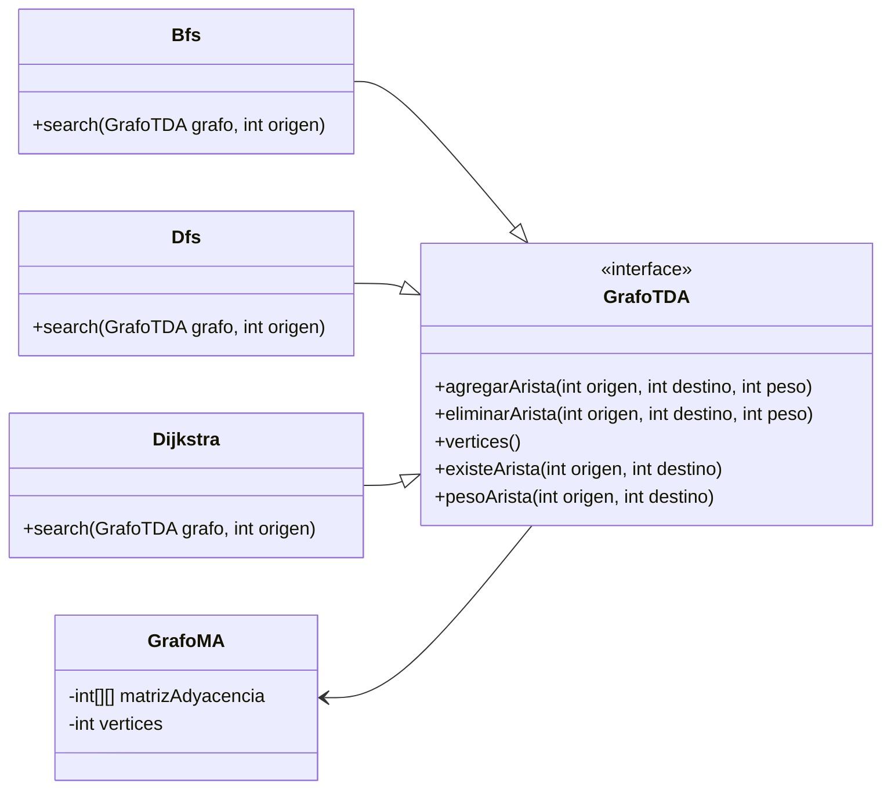

# TPO Programación III - MRI

**Carácter:** Obligatorio

**Fecha de Entrega:** 02/02/2023 por correo electrónico a `guirodriguez@uade.edu.ar`.

## Descripción

El entregable consiste en la entrega del `link  del repositorio GitHub con el proyecto Java` y un `informe` describiendo cada una de las etapas del proyecto.

El trabajo se puede realizar en grupo de hasta 2 personas o individual.

## Enunciado

Usted va a recibir la _Clase_ `Grafo` en Java y deberá implementar 3(tres) de los siguientes algoritmos:

- [x] Algoritmo Breadth-First Search (BFS)
- [x] Algoritmo Depth-First Search (DFS)
- [ ] Algoritmo de Prim
- [ ] Algoritmo de Kruskal
- [x] Algoritmo de Dijkstra
- [ ] Algoritmo de Floyd

Tenga en cuenta la representación del grafo (dinámica o estática) para la implementación de los algoritmos elegidos.

_Nota: Todos los archivos de configuración, ejemplos de entrada y cualquier otro recurso deben ser anexados al proyecto
dentro de una carpeta /resources._

# Informe

## El proceso

Para el desarrollo del TP se comenzó implementando la clase `GrafoMA` y su interfaz `GrafoTDA` ya que es utilizada por
los diferentes algoritmos.

El siguiente paso fue comenzar por implementar los algoritmos apoyandose en el pseudocódigo visto en clase y revisando
la bibliografía para más información.

Un cambio interesante que se realizó luego de revisar la bibliografía fue eliminar la variable `marca` del algoritmo
de `BFS` ya que en el libro de `Introduction to Algorithms` de _Thomas Cormen_ había una leve mejora del algoritmo en
donde se puede eliminar dicha variable y utilizar un flag de visitado o no visitado. Porque el marcar un nodo
como `gris` es meramente con fines didácticos y no afecta al funcionamiento del algoritmo.
Este cambio se pudo llevar a Dijkstra y a DFS también.

## Las implementaciones

### Algoritmo Depth-First Search (DFS)

Es un algoritmo de búsqueda en profundidad. Explora todo el grafo siguiendo cada rama hasta el final antes de volver
atrás.
Es muy útil para encontrar ciclos en los grafos y si existe un camino entre 2 nodos dados.

La implementación se realizó de forma recursiva. Es importante tener en cuenta que, en la implementación recursiva, el
orden en que se visitan los nodos dependerá de cómo estén organizados en la estructura de datos del grafo, lo que puede
influir en el rendimiento de la función. También es posible que se produzca un desbordamiento de pila si el grafo es
demasiado grande o profundo.
Otra opción es realizar dicha implementación usando una `pila`.

### Algoritmo Breadth-First Search (BFS)

Es un algoritmo de búsqueda en anchura. Recorre todos los nodos del grafo en orden por niveles desde un nodo inicial.
Útil para encontrar el camino más corto entre dos nodos.


### Algoritmo de Dijkstra

Es un algoritmo de búsqueda de caminos mínimos. Encuentra el camino más corto entre un nodo inicial y todos los demás
nodos del grafo. Utiliza una cola de prioridad para explorar los nodos en el orden óptimo.


## Estructura del proyecto

```
    prograIII/
    ├── src
    │   ├── main
    │   │   └── java
    │   │       └── com.uade.prograIII.tpo
    │   │           ├── algorithms
    │   │           │   ├── Bfs
    │   │           │   ├── Dfs
    │   │           │   └── Dijkstra
    │   │           ├── api
    │   │           │   └── GrafoTDA
    │   │           └── impl
    │   │               └── GrafoMA
    │   └── test
    │       └── java
    │           └── com.uade.prograIII.tpo
    │               ├── algorithms
    │               │   ├── BfsTest
    │               │   ├── DfsTest
    │               │   └── DijkstraTest
    │               └── impl
    │                   └── GrafoMATest
    ├── pom.xml
    └── README.md
```

Tal como se puede ver en el diagrama de abajo se implementaron 3 clases con los algoritmos elegidos y la clase `GrafoMA`
y su interfaz `GrafoTDA` para permitir la abstracción de la implementación de la clase grafo de su uso en los
algoritmos. Esto quiere decir que se podría implementar la clase grafo con listas de adyacencia y todos los algoritmos
funcionarán de igual manera.



## Cómo correr el proyecto

- Se puede visualizar el código ingresando a cada clase.
- Se puede correr los `tests`.
    - Esto se puede lograr haciendo corriendo los tests con el comando `mvn test`
    - O se puede hacer click derecho en la carpeta `test` y hacer click en `Run 'All tests'` (
      utilizando `IntelliJ IDEA`)
